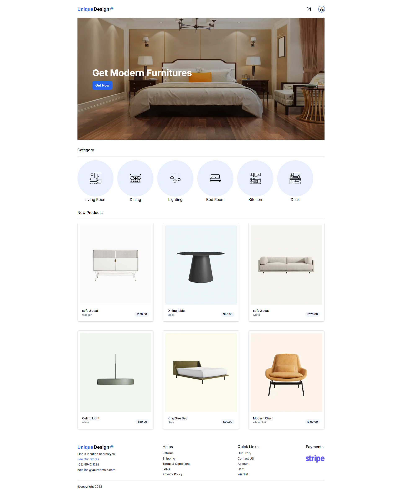

# Project Next.js typescript drizzle-kit zod ecommerce

This is a Full Stack Next.js Ecommerce project.I use latest tech stack next.js react server action.

## Tech Stack

**Full-Stack:** React, Next.js, Drizzle-ORM, Zustand, React-hook-form, Safe-server-action, Zod, Auth.js ,TailwindCSS

## Screenshots



## Live Server Link

[Nextjs Full Stack Ecommerce](https://github.com/Hadi4234/next-drizzle-ecom)

## Install Local

To run this project locally

```bash
  npm i
  npm run dev
```

## React hook form, Zod, Safe-server-action example

```javascript
'use client';

import { zodResolver } from '@hookform/resolvers/zod';
import { useForm } from 'react-hook-form';
import { z } from 'zod';

const formSchema = z.object({
  username: z.string().min(2, {
    message: 'Username must be at least 2 characters.',
  }),
});

export function ProfileForm() {
  // Define your form.
  const form =
    useForm <
    z.infer <
    typeof formSchema >>
      {
        resolver: zodResolver(formSchema),
        defaultValues: {
          username: '',
        },
      };
  // useAction
  const [error, setError] = useState('');
  const [success, setSuccess] = useState('');
  const { execute, status } = useAction(yourActionName, {
    onSuccess: (data) => {
      if (data?.error) setError(data.error);
      if (data?.success) {
        setSuccess(data.success);
      }
    },
  });
  // Define a submit handler.
  function onSubmit(values: z.infer<typeof formSchema>) {
    // execute from useAction(server action)
    execute(value);
  }
}
```

## License

[](https://choosealicense.com/licenses/mit/)
[](https://opensource.org/licenses/)
[](http://www.gnu.org/licenses/agpl-3.0)
